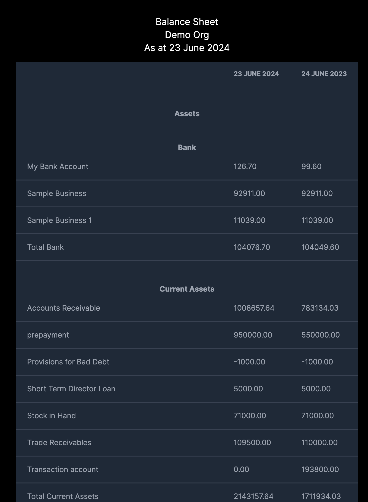

# Demyst Show Me The Money

## Screenshot



## Getting Started

Have mock Xero Balance Sheet API docker image running at port 3000 https://hub.docker.com/r/jaypeng2015/show-me-the-money.

Make a copy of `.env.example` and rename to `.env.local`.

Setup dev environment
```bash
npm i
```

Run the development server:
```bash
npm run dev
```

Or run the production build:
```bash
npm run build
npm run start
```

Open [http://localhost:3001](http://localhost:3001) with your browser to see the result.
